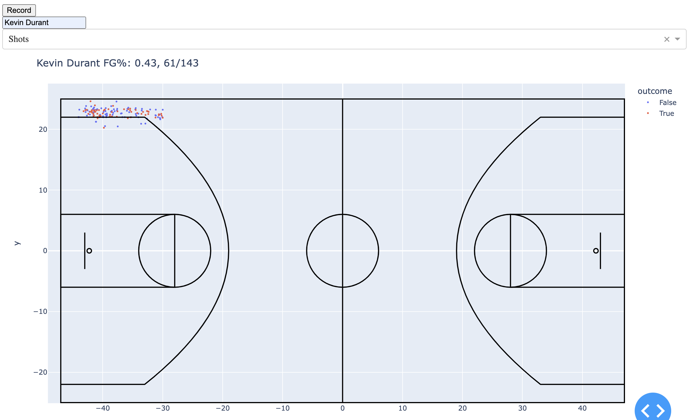
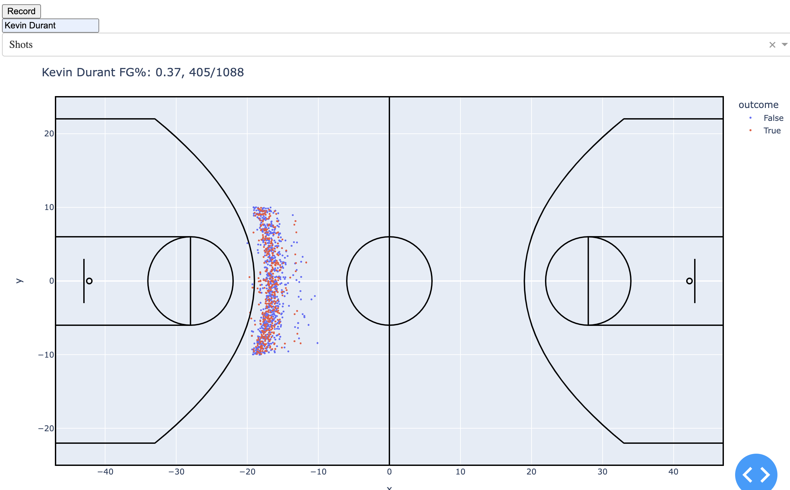
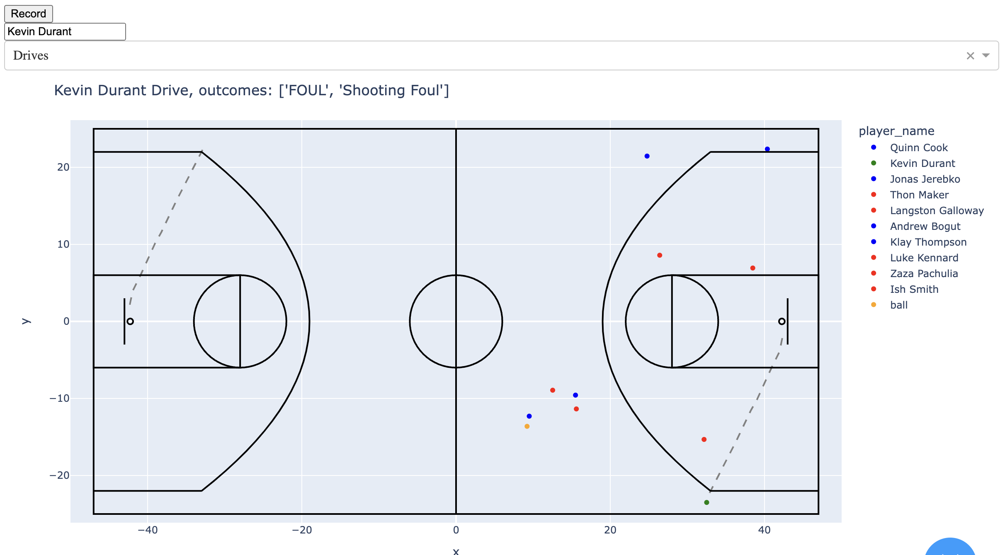
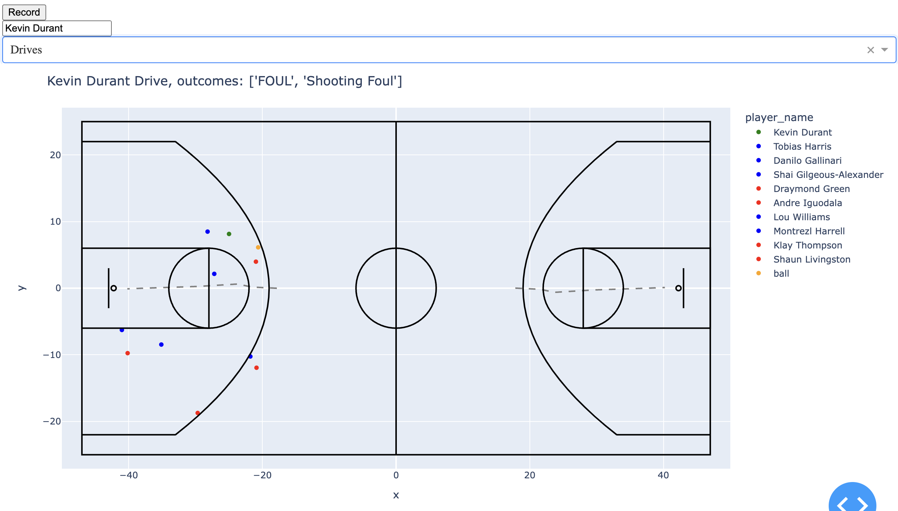

# 6851_final_project

Project Organization
------------

    ├── notebooks
    │   This folder is purely for exploration and testing.  I used these notebooks to test out new features.
    │ 
    ├── old
    │   This folder contains all of the code from the implementation studio, which was used for the old idea of this project. 
    │
    │   
    ├── app.py
    │   This file contains all of the frontend components and state of the interface. It uses methods from  
    │   helpers.py to get and process the data.   
    │ 
    ├── helpers.py
    │   This file has all of the functions to retrieve data, process it, and produce graphs   

--------

Setup Instructions

to start the application, navigate to the directory with app.py  
run `python app.py` or `python3 app.py`
This should output
```
Dash is running on http://127.0.0.1:8050/

 * Serving Flask app 'app'
 * Debug mode: on
```
open this url in your broswer, which should take you to the application web page

To run the demo, make sure `DEMO_MODE = True` is in app.py, which should be the default

For viewing drives and shots, there are two examples saved in the data folder  
Each example is for player Kevin Durant, so hit record and say "Kevin Durant" (this also works with entering text)

### Shots Examples
1. Select 'shots' as the stat type
2. Select a region that matches one of the following examples

The first example is for this region


The second examples is for this region


### Drives Examples
1. Select 'drives' as the stat type
2. Draw a path that matches one of the following examples

The first example is for this drive path


The second example is for this drive path
